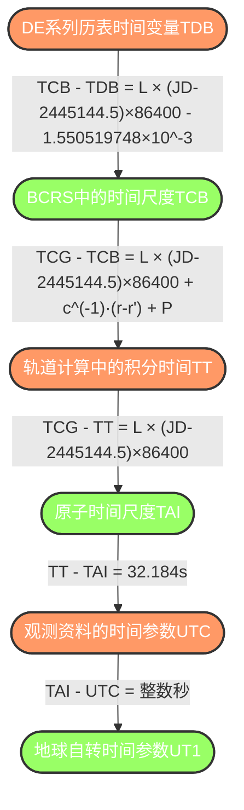

```mermaid
graph TD;
    %% 定义样式
    classDef defaultNode fill:#f96,stroke:#333,stroke-width:2px;
    classDef greenNode fill:#9f6,stroke:#333,stroke-width:2px;

    %% 创建节点
    DE([<span style="color:white">DE系列历表时间变量TDB</span>]):::defaultNode
    BCRS([<span style="color:white">BCRS中的时间尺度TCB</span>]):::greenNode
    GCRS([<span style="color:white">轨道计算中的积分时间TT</span>]):::defaultNode
    AT([<span style="color:white">原子时间尺度TAI</span>]):::greenNode
    UTC([<span style="color:white">观测资料的时间参数UTC</span>]):::defaultNode
    UT1([<span style="color:white">地球自转时间参数UT1</span>]):::greenNode

    %% 创建连接
    DE -->|"TCB - TDB = L × (JD-2445144.5)×86400 - 1.550519748×10^-3"| BCRS
    BCRS -->|"TCG - TCB = L × (JD-2445144.5)×86400 + c^(-1)·(r-r') + P"| GCRS
    GCRS -->|"TCG - TT = L × (JD-2445144.5)×86400"| AT
    AT -->|"TT - TAI = 32.184s"| UTC
    UTC -->|"TAI - UTC = 整数秒"| UT1
```

